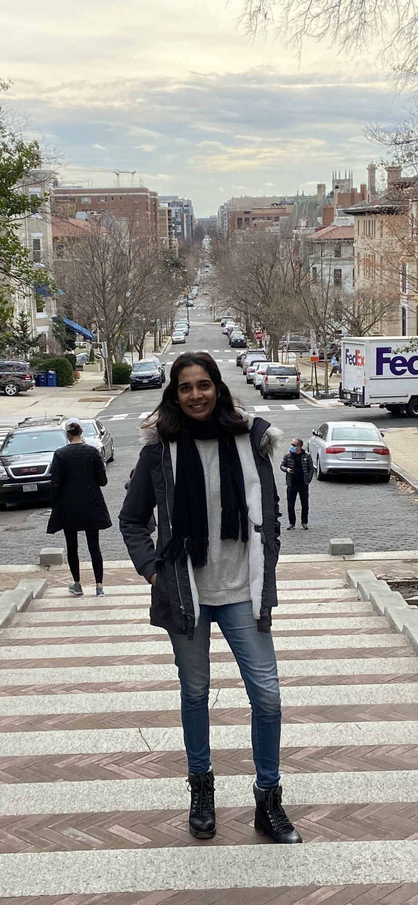

## Dhatri Badri's Portfolio Landing Page 

### Introduction

If you are seeing this, hi and welcome to my GitHub page! This is my personal space where I rave about all things related to Biology and Bioinformatics. You can skip to the good part and go directly to my website [here](dhatribadri.github.io). If you are stll here that's great! My name is Dhatri and I am a budding Bioinformatician. When I am not sitting in front of my computer breaking my head over my programming assignment, I am out exploring different neighborhoods in DC or Boston and hitting up museums to be inspired to think of new ways to solve problems.   

### Fun facts about me

It's always a little hard to get to know someone through their GitHub page—like I don't know anything about you. So let's break that ice and here are a couple of things you should know about me. If there is anything that you can relate with, connect with me! _**(scroll down for contact info)**_

1. I liste to Indie music regardless of how I am feeling 
2. I am chronically obsessed with Jupyter notebook and how convenient it is to program and run code on it
3. I am 5ft 11inches tall i.e. 180cm for my metric system buddies. 
4. I am chronically obsessed with the microbiome research field. 
(if you are working on projects involved in this area, please let me know, I would love to hear/be involved!) 

### Articles and books I am currently reading 

My all time favorite book is [Why Fish Don't Exist](https://www.simonandschuster.com/books/Why-Fish-Dont-Exist/Lulu-Miller/9781501160349#:~:text=Why%20Fish%20Don't%20Exist%20begins%20with%20a%20mesmerizing%20account,struggle%2C%20of%20heartbreak%20and%20chaos.)
Article I recently read is about [the direct and indirect effects cancer has on the human microbiom](https://doi.org/10.1016/j.trecan.2020.01.004)

### Contact me

Congratulations, you made it to the end! As a prize, you can connect with me on LinkedIn
