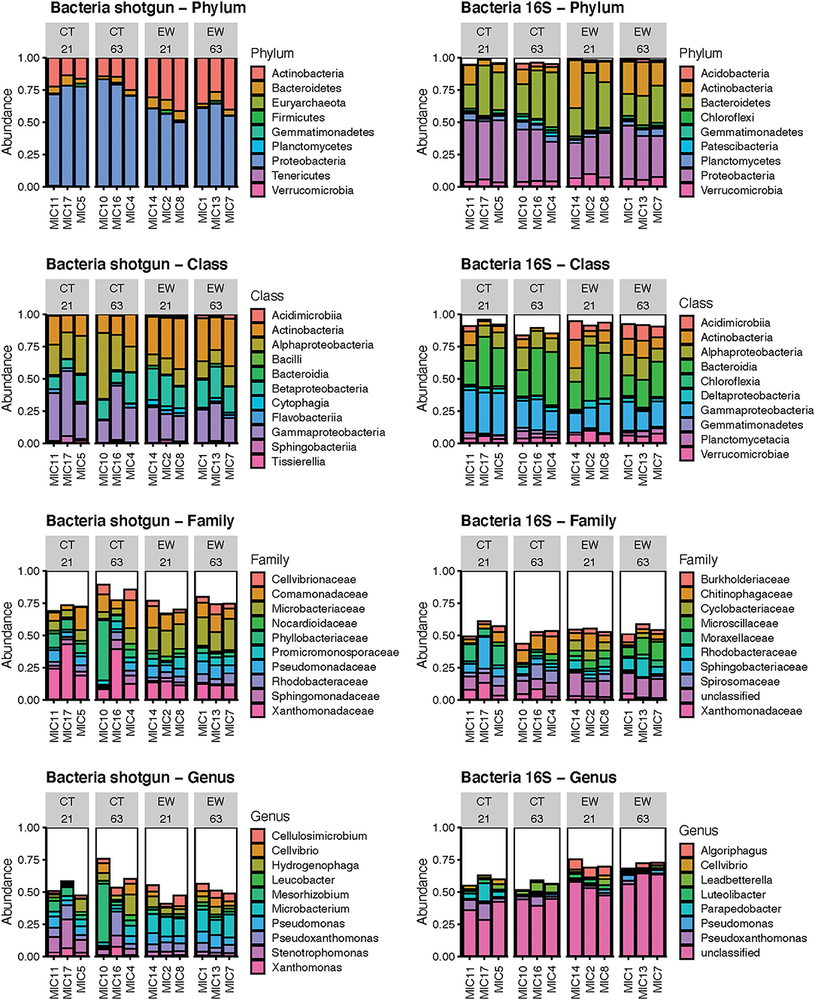
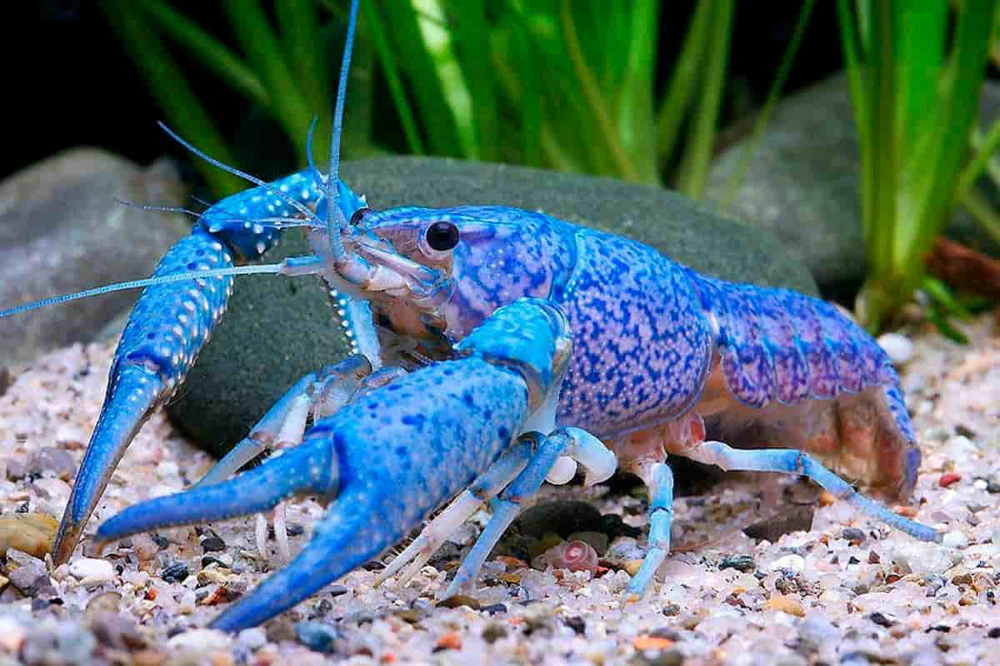

## My Portfolio

---

### Projects 

[Metagenomics and Metataxonomics of Vermicompost Microbiomes](/vermicompost)

---
[Finding potential epitope sites on COVID-19 S protein](/covid-19)
<video src="https://user-images.githubusercontent.com/56312676/206598179-2b8f7631-bdcf-4c5e-99d8-5e8c8ad2cfb8.mov" controls="controls" style="max-width: 730px;">
</video>

---
[Potential finding of new species of crayfish in the United Statess](/crayfish)

---

### Publications

[Here](https://scholar.google.com/citations?user=y-sIIrAAAAAJ&hl=en) is the link to my google scholar  
Feature [article](https://issuu.com/gwur/docs/gwur-vol4) in George Washington Undergraduate journal

---

### Articles I have written

- [Women soldiers are not the problem – standards are](https://gwur67.wixsite.com/blog/post/women-soldiers-are-not-the-problem-standards-are)
- [Influence of militarism on science and technology](https://gwur67.wixsite.com/blog/post/influence-of-militarism-on-science-and-technology)

---

<!--- (/pdf/sample_presentation.pdf) -->

---
<!-- 
Page template forked from <a href="https://github.com/evanca/quick-portfolio">evanca</a>
 -->
<!-- Remove above link if you don't want to attibute -->
