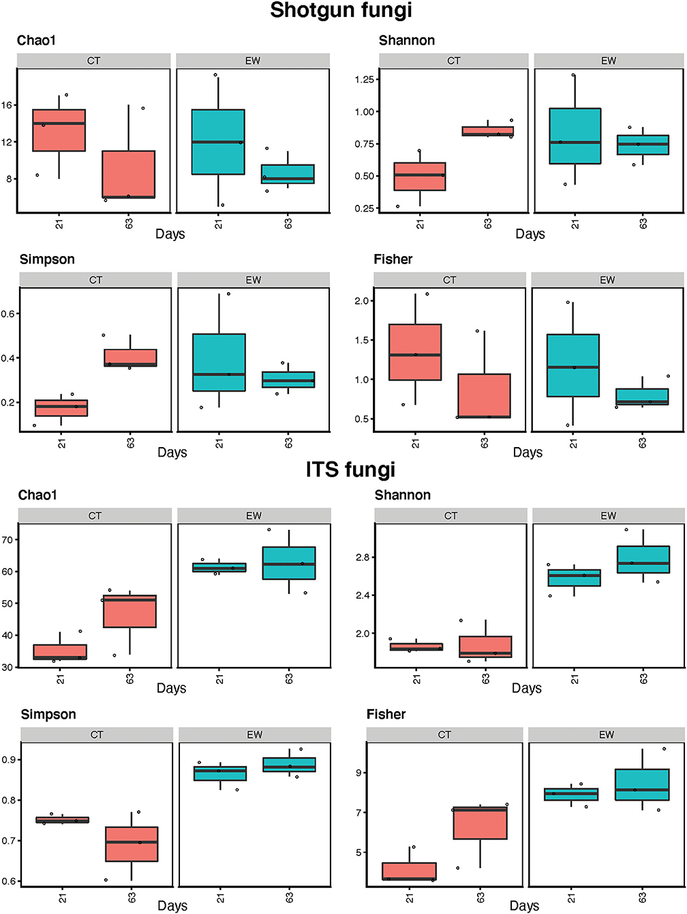
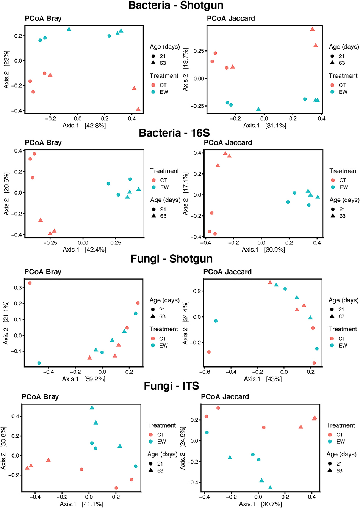

## Characterizing vermicompost microbiome based on shotgun and amplicon sequecing

**Project description:** This project aimed to compare inferences from metagenomic and metataxonomic 
data to characterize the diversity of the bacterial and fungal communities associated with vermicomposting.
Vermicomposting takes advantage of the synergistic effects of worms and microorganisms (bacteria and fungi) 
to decompose organic waste. Furthermore, worms can enrich the microbial communities of the resulting compost,
enhancing subsequent production as a richer form of organic fertilizer, thus offering a sustainable alternative 
to chemicals while converting waste products into fertilizer. 

### 1. How was data processed?

Microbial profiles were obtained by shotgun sequencing of genomes and through amplicon sequencing of 16S rRNA for bacteria and ITS for fungi.

Data from 16S and 18S sequencing were processed using the R package [*dada2* version 1.12](https://www.nature.com/articles/nmeth.3869). 
Then, the standard dada2 pipeline was applied to perform amplicon sequence variant (ASV)
inference, merge paired reads, and identify chimeras. Taxonomic assignment for 16S was
performed against the [Silva v132 database](https://doi.org/10.1093/nar/gks1219) using the dada2-formatted
training files for taxonomy and [species-level assignment](https://zenodo.org/record/1172783#.Y4l5PuzMI6A). Taxonomic
assignment for 18S was performed against the [Silva v132 Eukaryotic 18S database](https://zenodo.org/record/1447330#.Y4l5jOzMI6A).

Data from ITS sequencing were processed differently due to the variable size of the ITS region.
Raw reads from ITS sequencing were first subject to adapter trimming by [cutadapt version
2.3](https://doi.org/10.14806/ej.17.1.200) which removed primer sequences due to read-through. Taxonomic assignment for ITS was performed
against the [UNITE version 18.11.2018 database](https://unite.ut.ee/repository.php).

For the resulting 16S, 18S, and ITS dada2-processed data, ASV sequences were aligned using
[MAFFT](https://doi.org/10.1093/molbev/mst010) and used to build a tree with [FastTree](https://doi.org/10.1371/journal.pone.0009490). The resulting data were imported into [phyloseq](https://doi.org/10.1371/journal.pone.0061217) for further analysis.

### 2. What kind of data was I dealing with?
It is imperative to ask the right questions to elicit the the right responses. 
Overview of abundant taxa in each group—in phlya and class. Alpha and beta diversity indices. 

Alpha diversity: Chao, Shannon, Simpson, Fisher
Beta diversity: Bray, Jaccard

#### **Questions**
    1. What are the most abundant bacterial and fungal taxa in each group?
    2. Does taxonomic composition vary the same way across groups?
    3. Does alpha-diversity vary the same way across groups?
    4. Does beta-diversity vary the same way across groups?
    5. What are the most abundant bacterial functions in each group?
    6. Do bacterial functional profiles vary the same way across groups?

### 3. How was data analyzed?
Unfortunately, I was unable to upload all the pictures.

<html>
  <head>
    
  </head>
  <body>
    

      

        
      

      

        <h3>Paris is one of the most beautiful cities in France.
         Blah blah blah
        </h3>
      

    

  </body>
</html>

[//]: # (For more details see [GitHub Flavored Markdown](https://guides.github.com/features/mastering-markdown/).)
